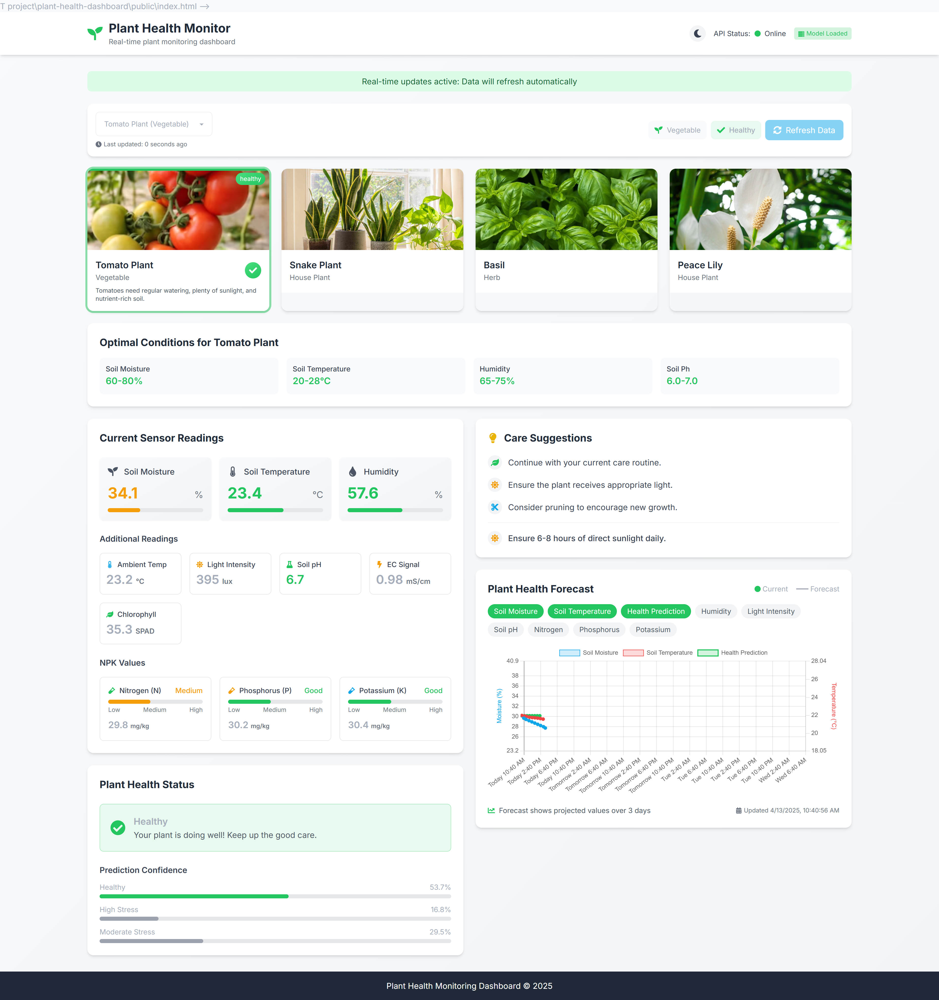
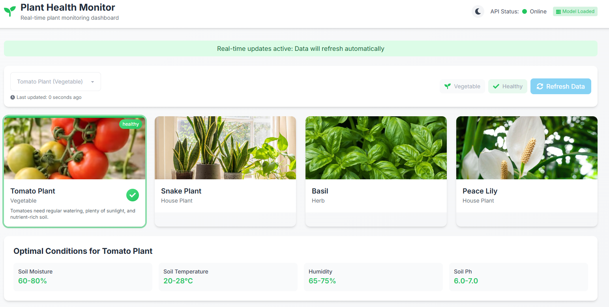
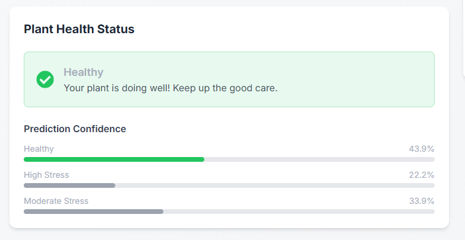
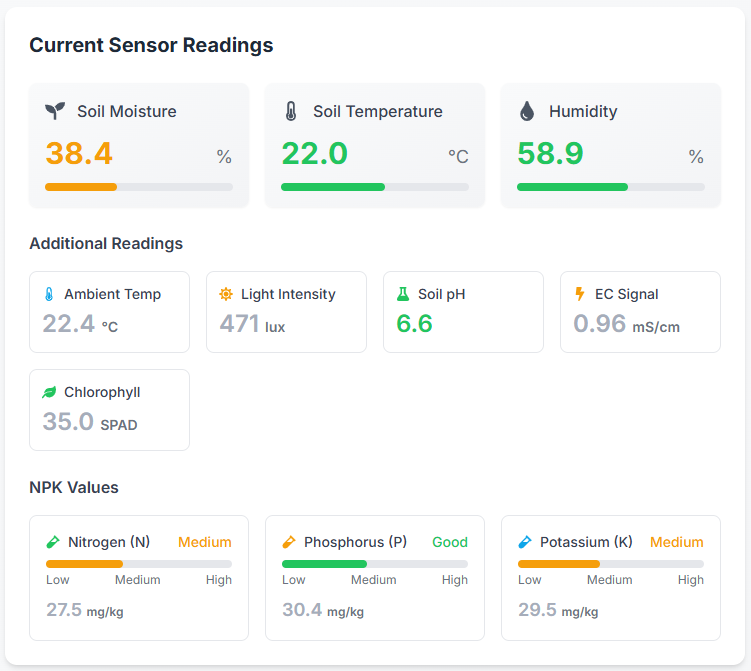
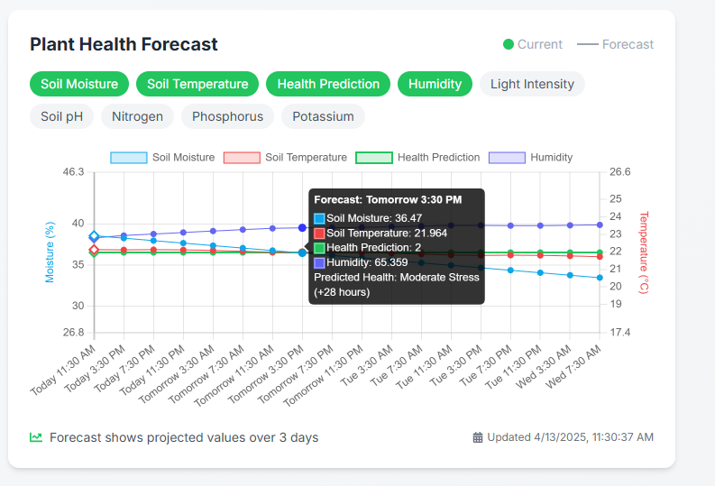
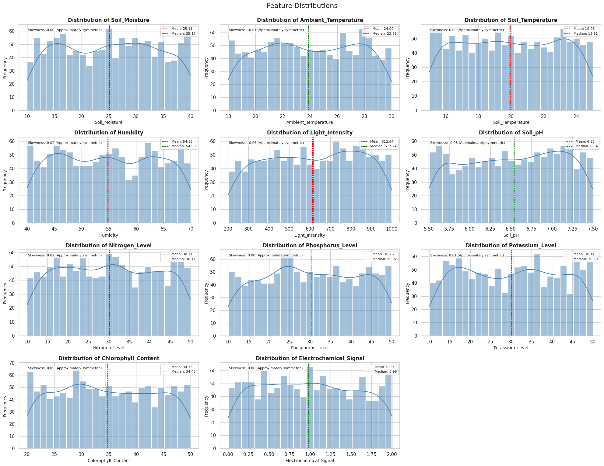
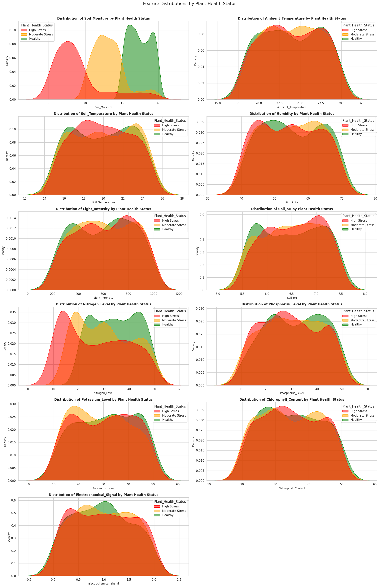
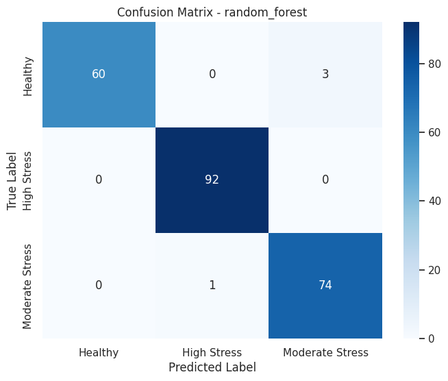
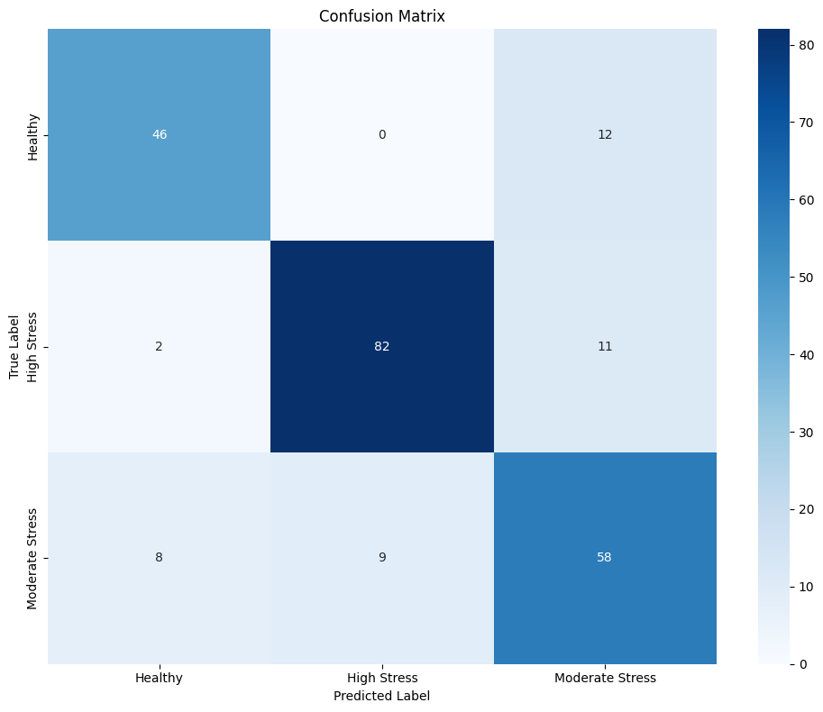

# 🌱 Smart Plant Health Monitoring System 🌿


<div align="center">
  
  <p><em>Real-time plant health monitoring using IoT devices and LSTM forecasting</em></p>
</div>

---

## 📊 Features

- 🔎 **Real-time Monitoring:** Continuous tracking of plant vital parameters.
- 🧠 **ML-Powered Analysis:** LSTM neural network and Random Forest for accurate plant health prediction.
- 📱 **Responsive Dashboard:** Modern UI built with React and TailwindCSS.
- 📈 **Predictive Forecasting:** 3+ day forecasts of plant health conditions.
- 🚨 **Alert System:** Notifications when parameters exceed safe thresholds.
- 🔄 **WebSockets:** Real-time updates without page refresh.
- 📊 **Historical Data:** Track trends and patterns over time.
- 🌡️ **Multi-Parameter Sensing:** Monitors temperature, moisture, NPK, pH, and more.

---
<div align="center">

  ```
## 🛠️ Architecture


 ┌─────────────────────┐     ┌─────────────────────┐      ┌────────────────────┐
│   HARDWARE LAYER    │     │   BACKEND LAYER     │      │   FRONTEND LAYER   │
│                     │     │                     │      │                    │
│  ┌───────────────┐  │     │  ┌───────────────┐  │      │ ┌───────────────┐  │
│  │    NodeMCU    │  │     │  │  Flask App    │  │      │ │  React App    │  │
│  └───────────────┘  │     │  └───────────────┘  │      │ └───────────────┘  │
│         │           │     │         │           │      │        │           │
│  ┌───────────────┐  │     │  ┌───────────────┐  │      │ ┌───────────────┐  │
│  │ Soil Sensors  │──┼─────┼─▶│ Data Service  │──┼──────┼▶│   Dashboard   │  │
│  └───────────────┘  │     │  └───────────────┘  │      │ └───────────────┘  │
│         ⬇️          │     │         │           │      │        │           │
│  ┌───────────────┐  │     │  ┌───────────────┐  │      │ ┌───────────────┐  │
│  │  History From │──┼─────┼─▶│ Model Service │──┼──────┼▶│    Charts     │  │
│  │   JSON File   │  │     │  │ (LSTM Model)  │  │      │ └───────────────┘  │
│  └───────────────┘  │     │  └───────────────┘  │      │                    │
└─────────────────────┘     └─────────────────────┘      └────────────────────┘
         │                           │                            │
         └───────────────────────────┼────────────────────────────┘
                                     │
                               WebSocket/HTTP
                              Communication

  ```
</div>

The system consists of three main components:

### 🔌 Hardware Layer
- **NodeMCU microcontroller** with WiFi capabilities.
- Multiple sensors (soil moisture, temperature, humidity, light, pH, NPK).

### ⚙️ Backend (Flask + SocketIO)
- RESTful API for data ingestion and retrieval.
- LSTM model integration for health prediction and forecasting.
- Real-time communication via WebSockets.
- Data persistence and management.

### 🖥️ Frontend (React)
- Responsive dashboard with real-time updates.
- Interactive charts and visualizations.
- Plant health status monitoring.
- Care suggestions based on plant condition.

---

## 💻 Technology Stack

- **Backend:** Python, Flask, SocketIO, TensorFlow, NumPy  
- **Frontend:** React, Chart.js, TailwindCSS, DaisyUI  
- **Machine Learning:** LSTM neural networks, scikit-learn, and Random Forest  
- **Hardware:** NodeMCU ESP8266, Various environmental sensors

---

## 📊 Supported Sensors

| **Sensor Type**    | **Measurements**                   | **Range**               |
|--------------------|------------------------------------|-------------------------|
| **Soil Moisture**  | Water content percentage           | 0-100%                  |
| **Temperature**    | Ambient and soil temperature       | -10°C to 50°C           |
| **Humidity**       | Air humidity                       | 0-100%                  |
| **Light**          | Light intensity                    | 0-65535 lux             |
| **Soil pH**        | Acidity/alkalinity                 | pH 3.5-9.0              |
| **NPK Sensor**     | Nitrogen, Phosphorus, Potassium    | 0-100 mg/kg             |
| **Chlorophyll**    | Leaf chlorophyll content           | 0-50 SPAD               |
| **EC Signal**      | Electrochemical activity           | 0-5 mS/cm               |

---

## 🚀 Getting Started

### Prerequisites
- Python 3.10+
- Node.js 16+
- Arduino IDE (for hardware programming)
- Required sensors and NodeMCU ESP8266

### Installation

#### Backend Setup
```bash
# Clone the repository
git clone https://github.com/enoshrodrigo/plant-health-IOT.git
cd plant-health-IOT

# Create and activate virtual environment
python -m venv venv
source venv/bin/activate  # On Windows: venv\Scripts\activate

# Install dependencies
pip install -r requirements.txt

# Run the server
python run.py
```

#### Frontend Setup
```bash
# Navigate to the dashboard directory
cd plant-health-dashboard

# Install dependencies
npm install

# Start development server
npm start
```

#### Hardware Setup
- Wire the sensors to NodeMCU ESP8266 according to the pinout diagram.
- Flash the NodeMCU using Arduino IDE with the provided code.
- Configure WiFi settings to connect to your local network.
- Power on the device and verify connectivity.

---

## 📱 Screenshots

<div align="center">
  
  
  <br>
  
  
</div>

---

## 📊 Model Evaluation

### Feature Distribution
<div align="center">
  
</div>

### Feature Distribution by Plant Health Status
<div align="center">
  
</div>

### Random Forest Classification

**Model:** `random_forest`  
**Best Parameters:** `{'classifier__max_depth': None, 'classifier__min_samples_split': 5, 'classifier__n_estimators': 200}`

**Classification Report:**
```
                 precision    recall  f1-score   support

        Healthy       0.97      0.97      0.97        58
    High Stress       0.99      0.99      0.99        96
Moderate Stress       0.96      0.96      0.96        76

       accuracy                           0.97       230
      macro avg       0.97      0.97      0.97       230
   weighted avg       0.97      0.97      0.97       230
```

<div align="center">
  
</div>

### LSTM Forecasting Classification

**Model:** `LSTM`

**Classification Report:**
```
                 precision    recall  f1-score   support

        Healthy       0.82      0.79      0.81        58
    High Stress       0.90      0.86      0.88        95
Moderate Stress       0.72      0.77      0.74        75

       accuracy                           0.82       228
      macro avg       0.81      0.81      0.81       228
   weighted avg       0.82      0.82      0.82       228
```

<div align="center">
  
</div>

---

## 🌐 Data Source

The sensor and plant health data used in this project is available on Kaggle.  
[Plant Health Data on Kaggle](https://www.kaggle.com/datasets/ziya07/plant-health-data)

---

## 📈 LSTM Forecasting

The system uses Long Short-Term Memory (LSTM) neural networks to predict plant health conditions:

- Processes historical sensor data to identify patterns.
- Predicts future values for key parameters (moisture, temperature, etc.).
- Classifies plant health status (Healthy, Moderate Stress, High Stress).
- 3+ day forecasting with hourly granularity.

---

## 🌐 API Reference

### Endpoints
- **GET** `/health` - System health check
- **GET** `/predict/{plant_id}` - Get current plant health prediction (Random Forest)
- **GET** `/forecast/{plant_id}` - Get forecast for specific plant (LSTM neural networks)
- **POST** `/sensor_reading` - Submit new sensor readings

### WebSocket Events
- **connect** - Connection established
- **plant_health_update** - New health status available
- **plant_forecast_update** - Updated forecast available
- **sensor_reading** - New sensor data received

---
## 🚀 Future Suggestions

- **Automated Irrigation:** Add an automated irrigation system based on sensor data.
- **Mobile App Integration:** Integrate a mobile app for instant notifications.
- **Cloud Storage:** Use cloud storage for large-scale data handling.
- **Voice Assistant Support:** Support voice assistant integration (e.g., Alexa).
- **Renewable Energy:** Use solar panels for energy autonomy.
- **Data Collection:** Currently, the dataset is limited; collecting more data will help improve the LSTM forecasting accuracy.

---
## 📄 License

This project is licensed under the MIT License - see the [LICENSE](LICENSE) file for details.

---

## 🌟 Contributing

Contributions are welcome! Please feel free to submit a Pull Request.

---

## 📞 Contact

For questions and support, please open an issue or contact the repository owner.

<div align="center">
  <p>Made with ❤️ for plants and planet</p>
  <p>© 2025 Smart Plant Health Monitoring System</p>
</div>
